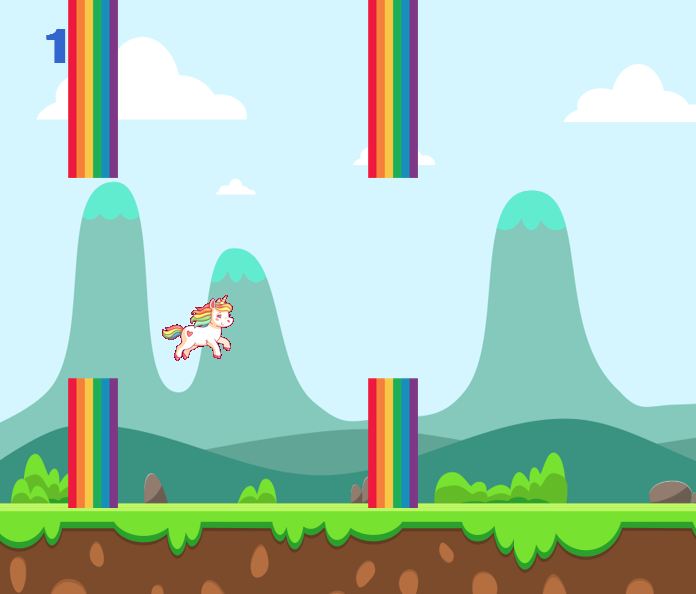

# Game Title
Unicorn Journey
## Author: 
Paulina Iwach
### Short description
Unicorn Journey is a game in which the player's task is to fly the unicorn and avoid rainbow obstacles.\
Controls: press spacebar to make the unicorn fly.\
Game over: The game is over when the unicorn touches the rainbow or hits the ground.

### Technologies
**pygame** - Library that helps in creating computer games in Python. Provides meny helpful modules, such as displaying graphics, playing sounds, and operating keys.\
**pygame_menu** -  Library that simplifies the creation of a menu for a game written with pygame module in Python.

### How to run this app?
1. Clone the template project to your device:\
`git clone  https://github.com/github-Paulina-I/unicorn_game.git Unicorn_Game`\
`cd Unicorn_game `
2. Install the project's development and runtime requirements:
`pip install -r requirements.txt`
3. Run the game:
 `python Unicorn_game.py`